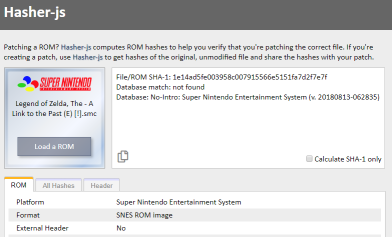

# Hasher-js



Hasher-js is the javascript counterpart to the C# application *ROM Hasher*. It 
calculates checksums to validate ROMs and performs a database lookup.

## Contents
  * [What It Consists Of](#what-it-consists-of)
  * [Tests](#tests)
  * [Files](#files)
  * [Usage](#usage)
    + [Deployment](#deployment)
    + [NPM Commands](#npm-commands)
    + [As A Library](#as-a-library)
    + [Configuration](#configuration)
    + [Polyfill](#polyfill)
  * [Notes](#notes)
    + [Databases](#databases)
  * [License](#license)
    + [js-sha1](#js-sha1)
    + [js-md5](#js-md5)

## What It Consists Of
The primary component of hasher-js is a javascript library that accepts a file and 
returns platform and rom database identification. Additional platform-specific 
"extended data" may also be provided, e.g. internal header decoding, or layout 
information for multipart ROMs such as iNES. 

Hasher-js also includes an optional HTML front-end. Additionally, a simple 
development server is included to run the page locally. When a build is performed, 
in addition to creating the bundle, any necessary files for the front-end are 
copied to the `/dist` directory.

First run the command `npm run build` to build the hasher-js library and front-end, 
then run the command `npm run start` start the development server. Access the page 
at `http://localhost:8000`.

## Tests

Tests are found in the `/test` directory. First make sure to build the project: 
`npm run build`, then build the tests: `npm run build-test`. After building launch 
the local server: `npm run start`. Tests are performed in the browser by accessing 
the page at `http://localhost:8000/test`.

## Files

* `/frontend` - HTML and related resources for front-end.
* `/src` - Main source for the hasher-js library.
* `/src/db` - No-Intro database in JSON format.
* `/test` - Tests. Test page is served from here.
* `/dist` - Created when the bundle is built. Front-end served from here.
* `/dist/hasher.js` - Compiled Hasher bundle.

## Usage

### Deployment

While hasher-js may be used as a module or as a bundle,  it can also be 
deployed as a stand-alone web application using the included HTML 
front-end.

When used as a library, the databases should be present and by default 
are requested via a relative URL: `db/<platform>.json`. The path of the 
directory can be configured (see below).

When deployed as a stand-alone application, build the project via the command 
`npm run build`. All the necessary files are output to the `/dist` directory, 
which may be copied to the server and served statically.

### NPM Commands

* **`npm run build`** - Production build. Outputs minified bundle, front-end, and database in `/dist` directory.
* **`npm run build-dev`** - Development build. Same as production build, except bundle is not minified and includes inline source-map.
* **`npm run build-test`** - Builds tests. Perform a build (development or production) first as the tests expect the bundle to be present.
* **`npm start`** - Starts the development server. Front-end is accessible at `http://localhost:8000/`. Tests are accessible at `http://localhost:8000/test/`.

### As A Library
You can include the hasher bundle in your HTML or include the module via javascript.

* `<script src='hasher.js'></script>`
* `const Hasher = require('hasher-js');`
* `import * as Hasher from 'hasher-js'`;

Hasher-js exports a constructor, `Hasher()`, which accepts a `File` object. The 
returned object has two methods:

* **`getRomData(algos?: string[] | null, progressCallback?: function(number))`** - begins processing the file and returns a Promise that resolves to a `RomData` object. 
  * `algos` - Optional. A list of supported hash algorithms to calculate (e.g. "crc32", "sha1"). Omit this argument or specify null to use the default set of hashes.
  * `progressCallback` - Optional. Called with a fractional value between 0 and 1 to report progress.
* **`cancel()`** - can be called to cancel the file hashing. (The promise will still resolve and return any decoded data). 

Hasher-js also exports the following utility method(s):
* **`Hasher.FormatHex`**`(value: number, minLength?: number, prefixed?: boolean)` - Formats a number with the same casing and, optionally, the same prefix, that Hasher-js uses internally

Sample usage:
```javascript
/*
    new Hasher(rom: File):
    {
        getRomData: function(
            algos?: string[] | null,
            progressCallback?: function(number): void
        ): Promise<RomData>,
        cancel: function(): void
    }
*/

var hashObj = new Hasher(myFile);

// Output progress to the console
var progressCallback = function(progress) { 
    var percent = Math.floor(progress * 100);
    console.log("% done: " + percent);
};

// Allow the user to cancel long operations
document.getElementById('cancel-button').onclick = function() { 
    hashObj.cancel(); 
};

// Display our ROM database match on the console
hashObj.getRomData(null, progressCallback)
    .then(function(romData) {
        // Display the name of the game to the console
        console.log("No-Intro name: " + romData.dbMatch);
    });
```

`RomData` type:

```javascript
// Any properties not outlined here are subject to change in future versions

{
    platformIdent: "none" | "contents" | "extension" | "contents extension",
    platform: {
        name: string,
        knownExtensions: string[]
    },
    hashRegions: {
            name: string, // typically "file" and "rom", but can include 
                          // platform specific regions like "PRG" and "CHR"
            start: number,
            length: number
    } [],
    hasExternalHeader: boolean,
    dbInfo: {
        name: string,
        version: string
    },
    dbMatch: string,
    extendedData: {
        category?: string, 
        label: string, 
        value: string
    } [],
    format: string,
    hashes: {
            name: string, // name is a concatenation of a hash region name and
                          // algorithm identifier, e.g. rom_sha1 or file_md5
            value: string // hex string
    } [],
}
```

Note that although the items in the `hashes` array contain `offset` and 
`length` properties, these values may not refer to the file itself. They could refer to a location within an extracted and/or converted ROM 
image, e.g. deheadered/de-interleaved ROM.

### Configuration

The path of the ROM database can be configured at runtime:

* **`window.hasherDbPath`** - Specifies the path containing the JSON files. 
Should not include a trailing slash. If not specified, the default relative 
path of `"db/"` is used.

### Polyfill

Hasher-js requires ES5 plus the following additional features:

* Promise
* String.prototype.startsWith
* Array.prototype.find
* Object.assign

These features are implemented via polyfill.io in the included front end.

## Notes

### Databases

After identifying the platform of a ROM image, the software attempts to 
request the appropriate database at the relative URL 
`db/*platform-name*.json`. The default databases are No-Intro databases, 
converted to JSON. The JSON objects contain a property, `meta`, with 
additional information about the database.

The following regexes are used to convert the No-Intro databases to json 
(using VSCode) (additional massaging will be required):

``` regex
Clr-Mame-Pro format
replace:
    game \(.*\n\Wname\W"(.*)\".*\n.*\n?.*\n.*sha1 ([a-zA-Z0-9]*).*\n\W?\)\W\n
with:
    "$2": "$1",\n

CLR MAME Pro XML - 
replace:
    <game name="(.*)">\n.*\n.*sha1="([A-Z0-9]+)".*\n\W</game>\n
with:
    "$2": "$1",\n
```

## License

Hasher-js is distributed under WTFPL 2.0 (see license.txt.). Hasher-js uses 
the following third-party components that are referenced by the Hasher-js 
source code and included in the compiled bundle:

### js-sha1

    Copyright 2014-2017 Chen, Yi-Cyuan
    
    Permission is hereby granted, free of charge, to any person obtaining
    a copy of this software and associated documentation files (the
    "Software"), to deal in the Software without restriction, including
    without limitation the rights to use, copy, modify, merge, publish,
    distribute, sublicense, and/or sell copies of the Software, and to
    permit persons to whom the Software is furnished to do so, subject to
    the following conditions:
    
    The above copyright notice and this permission notice shall be
    included in all copies or substantial portions of the Software.
    
    THE SOFTWARE IS PROVIDED "AS IS", WITHOUT WARRANTY OF ANY KIND,
    EXPRESS OR IMPLIED, INCLUDING BUT NOT LIMITED TO THE WARRANTIES OF
    MERCHANTABILITY, FITNESS FOR A PARTICULAR PURPOSE AND
    NONINFRINGEMENT. IN NO EVENT SHALL THE AUTHORS OR COPYRIGHT HOLDERS BE
    LIABLE FOR ANY CLAIM, DAMAGES OR OTHER LIABILITY, WHETHER IN AN ACTION
    OF CONTRACT, TORT OR OTHERWISE, ARISING FROM, OUT OF OR IN CONNECTION
    WITH THE SOFTWARE OR THE USE OR OTHER DEALINGS IN THE SOFTWARE.

### js-md5

    Copyright 2014-2017 Chen, Yi-Cyuan
    
    Permission is hereby granted, free of charge, to any person obtaining
    a copy of this software and associated documentation files (the
    "Software"), to deal in the Software without restriction, including
    without limitation the rights to use, copy, modify, merge, publish,
    distribute, sublicense, and/or sell copies of the Software, and to
    permit persons to whom the Software is furnished to do so, subject to
    the following conditions:
    
    The above copyright notice and this permission notice shall be
    included in all copies or substantial portions of the Software.
    
    THE SOFTWARE IS PROVIDED "AS IS", WITHOUT WARRANTY OF ANY KIND,
    EXPRESS OR IMPLIED, INCLUDING BUT NOT LIMITED TO THE WARRANTIES OF
    MERCHANTABILITY, FITNESS FOR A PARTICULAR PURPOSE AND
    NONINFRINGEMENT. IN NO EVENT SHALL THE AUTHORS OR COPYRIGHT HOLDERS BE
    LIABLE FOR ANY CLAIM, DAMAGES OR OTHER LIABILITY, WHETHER IN AN ACTION
    OF CONTRACT, TORT OR OTHERWISE, ARISING FROM, OUT OF OR IN CONNECTION
    WITH THE SOFTWARE OR THE USE OR OTHER DEALINGS IN THE SOFTWARE.
